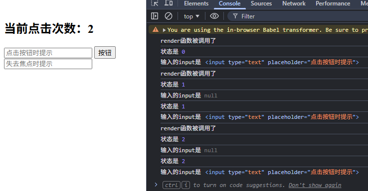
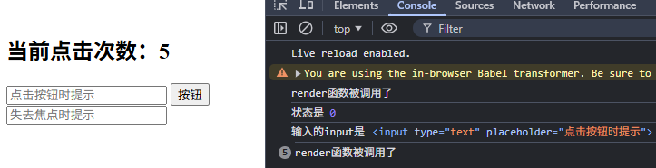

# 01-React基础

## 01-HelloReact

### 重点
- 介绍 React 的最基本使用：创建虚拟 DOM 并将其渲染到页面中。
- 核心库：`react.development.js`
- DOM 操作库：`react-dom.development.js`
- JSX 解析：`babel.min.js`

### 用法
- 在 HTML 中引入 `react`、`react-dom`、`babel`。
- 在 `<script type="text/babel">` 里编写 JSX。
- 使用 `ReactDOM.render(vDOM, DOM节点)` 将虚拟 DOM 渲染到页面。


### 注意事项
- JSX 只能在 `type="text/babel"` 的脚本中直接使用，babel会把jsx转换成js。
- 渲染目标节点需要先存在，例如 `document.getElementById('test')`。
- 虚拟DOM比较轻，真实DOM比较重，因为虚拟DOM是React内部在用，无需真实DOM上那么多的属性
- 虚拟DOM最终会被React渲染成真实DOM，只有真实DOM才能被浏览器识别

---

## 02-JSX基本使用

### 重点
- 讲解创建虚拟 DOM 的两种方式：`React.createElement()` 和 JSX。
- 演示 JSX 中如何使用变量、属性、文本、嵌套标签。

### 用法
- 原生创建方式：
  - `React.createElement('h2', { id: myID }, React.createElement('span', {}, myData))`
- JSX 创建方式：
  - `<h2 id={myID.toUpperCase()}><span className="red">{myData.toUpperCase()}</span></h2>`
- JSX 中使用变量：`{myID}`、`{myData}`。
- JSX 中写 class 属性时使用 `className`。
- 在 JSX 中使用数组渲染列表：`arr.map((item, index) => <li key={index}>{item}</li>)`。

```jsx
// JSX 创建
const vDOM = (
    <h2>
        hello, react
    </h2>
)
ReactDOM.render(vDOM, document.getElementById('test'))
```
```js
// 原生创建
const vDOM = React.createElement('h2', {}, 'hello, react')
ReactDOM.render(vDOM, document.getElementById('test'))
```

### 注意事项
- JSX 需要通过 Babel 转换成 `React.createElement` 调用，创建虚拟 DOM。
- 虚拟DOM只能有一个根节点，不支持多个根节点，可以使用 `<div>`或者 `<></>` 包裹多个根节点。
- JSX 标签属性可以是 JS 表达式，写在 `{}` 中。只能写 JS 表达式，不能写 JS 语句。
- 内联样式写法：`style={{ color: 'red' }}` ，外层 {} 表示是 JS 表达式，内层 {} 表示是 JS 对象。
- JSX 标签属性 `class` 需改为 `className`，否则会报错。
- JSX 内部标签要闭合，否则报错：`Uncaught SyntaxError: Inline Babel script: Unterminated JSX contents`
- 标签首字母：
  - 如果小写，会被解析成 HTML 标签（如果不存在，报错为`The tag <good> is unrecognized in this browser. If you meant to render a React component, start its name with an uppercase letter.`）
  - 如果大写，会被解析成自定义标签（如果未定义，报错为`Uncaught ReferenceError: Good is not defined`）。
- 列表渲染时需要 `key` 属性；示例中使用 `index` 作为 key，但这只是临时方案，实际项目中应避免用索引作为 `key`，而是使用对象的 `id` 或其他唯一标识符。如果使用 `index` 作为 `key`，当数组中的元素顺序发生变化时，React无法正确识别哪些元素发生了变化，从而导致性能问题和意外的行为。

---

## 03-组件的基本使用

### 重点
- 介绍 React 组件的两种创建方式：函数式组件和 ES6 类组件。
- 组件名称首字母必须大写，否则会被解析为 HTML 原生标签。

### 用法
- 函数组件：
  - `function MyComponent() { return <h2>工厂函数组件(简单组件/无状态)</h2> }`
- 类组件：
  - `class MyComponent2 extends React.Component { render() { return <h2>ES6类组件(复杂组件/有状态)</h2> } }`
- 使用组件标签渲染：`ReactDOM.render(<MyComponent />, document.getElementById('example1'))`
- React 会根据组件类型：
  - 函数组件直接调用组件函数返回 JSX。
  - 类组件创建实例后调用 `render()` 方法返回 JSX。

### 注意事项
- 组件不是vDOM，渲染组件时需要用标签包裹，不能像vDOM那样直接放在第一个参数中 `ReactDOM.render(MyComponent, element)` ，否则会报错 `Warning: Functions are not valid as a React child. This may happen if you return a Component instead of <Component /> from render. Or maybe you want to call this function rather than return it.`
- 组件名首字母必须大写；小写组件名会被当作 HTML 标准标签处，报错 ``The tag <myComponent> is unrecognized in this browser. If you meant to render a React component, start its name with an uppercase letter.``。
- 函数组件内部 `this` 为 `undefined` （严格模式下babel 会把自定义函数内原本指向window的 `this` 转换成 `undefined` ）。
- 类组件中的 `this` 指向组件实例，可以访问 `this.props` 和 `this.state`。
- 函数组件适合“简单组件 / 无状态组件”，类组件适合“复杂组件 / 有状态组件”。
- 组件本身必须返回一个合法 JSX 结构，且只有一个顶层根节点。

---

## 04-state

### 重点
- 介绍 React 中的 state（状态）：组件的私有数据，用于记录组件的动态信息。
- state 只能在类组件中直接使用；函数组件需要使用 Hooks（后续学习）。
- - 事件处理函数中的 `this` 指向问题及解决方案。
- 通过 `this.setState()` 修改状态，促发重新渲染；不能直接修改 `this.state`。

### 用法
- 在 `constructor` 中初始化 state，并绑定事件处理函数：
  ```jsx
  constructor(props) {
    super(props)
    this.state = { isPig: true }
    this.handleClick = this.handleClick.bind(this)
  }
  ```
- 在事件处理函数中使用 `this.setState()` 更新状态：
  ```jsx
  handleClick() {
    let isPig = !this.state.isPig
    this.setState({ isPig })
  }
  ```
- 在 JSX 中访问状态：`this.state.isPig` 或解构 `let { isPig } = this.state`
- 在 JSX 中使用事件处理函数：`onClick={this.handleClick}`

- **简写方式**：直接在类中声明 state 和箭头函数方法
  ```jsx
  state = { isPig: true }
  handleClick = () => { ... }
  ```

### 注意事项
- 在 JSX 中绑定事件处理函数：`onClick={this.handleClick}` 
  -  React重新封装了事件，`onclick` 要使用驼峰命名。
  -  事件处理函数要用 `{}` ，不能像原生js那样用字符串。
  -  `onClick={this.handleClick()}` 会在渲染时执行函数，并且把函数调用的返回值赋给 `onClick`，点击时就不会调用事件处理函数。
  -  在React中获取原生事件：`e.nativeEvent`
- 由于事件处理函数 `this.handleClick` 是作为 `onClick` 的回调，所以不是通过实例调用的，是直接调用；并且类中的方法（constructor和render除外）默认开启了局部严格模式，所以在事件处理函数中 `this` 为 `undefined`。
- 事件处理函数中的 `this` 问题可通过两种方式解决：
  1. 在 constructor 中使用 `bind`：`this.handleClick = this.handleClick.bind(this)` （把原型链上的函数绑定到实例上，console.log中可以看到实例和原型链上各有一个 `handleClick`）
  2. 使用赋值语句 + 箭头函数声明方法（赋值语句会把函数绑定到实例上，console.log中可以看到实例上有 `handleClick`，而原型链上没有；并且箭头函数内部的 `this` 指向外层作用域的 `this`）
- 事件处理函数中不能直接修改 state：`this.state.isPig = false` 不会触发重新渲染。必须使用 `this.setState()` （父类React.Component中的方法）来更新状态。
- constructor中的 `state` 直接赋值，不要使用 `setState`
- state 的更新是属性的合并，不是替换；并且是异步的，不会立即生效。
- 类组件中的 `render` 会被调用1+n次，第一次是渲染实例的时候，后面的n次是在事件处理函数中更新状态的时候。

---

## 05-props

### 重点
- 介绍 React 中的 props（属性）：用于父组件向子组件传递数据的机制。
- props 是只读的，不能修改。
- 支持 props 类型验证和默认值设置。
- 既适用于类组件，也适用于函数组件（state, refs只能用于函数组件）。

### 用法
- 渲染组件时传递属性：
  ```jsx
  <Person name={p1.name} sex={p1.sex} age={p1.age} />
  ```
- 使用展开运算符将对象的所有属性通过props传递：
  ```jsx
  <Person {...p2} />
  ```
- 在类组件中访问 props：`this.props` 或解构 `let { name, age, sex } = this.props`
- 在函数组件中访问 props：通过函数参数 `function Person(props) { ... }`
- 对props中属性进行类型限制，和必要性限制（需引入 `prop-types.js`）：
  ```jsx
  static propTypes = {
    name: PropTypes.string.isRequired,
    sex: PropTypes.string.isRequired,
    age: PropTypes.number
  }
  ```
- 设置 props 默认值：
  ```jsx
  static defaultProps = {
    age: 18
  }
  ```

### 注意事项
- props 是只读的，不能修改；只有通过重新渲染组件（传递新的 props）才能更新显示。
- `propTypes` 和 `defaultProps` 是类的静态属性，用 `static` 关键字声明。
- 类型验证中，`isRequired` 表示该属性为必需的。
  如果未提供必需的 props，控制台会有警告。
- 展开运算符 `{...object}` 可简化传递多个 props，但需确保对象的属性名与组件的 props 名匹配。
- 函数组件中也可以使用 `propTypes` 和 `defaultProps`：
  ```jsx
  Person.propTypes = { ... }
  Person.defaultProps = { ... }
  ```

---

## 综合提醒
- state 是组件内部的可变数据，props 是从外部传入的只读数据。
- state 改变时会触发重新渲染；props 改变也会触发重新渲染。
- 简写方式（箭头函数、直接赋值 state）是现代 React 类组件的标准写法，推荐使用。
- 后续学习中，函数组件配合 Hooks 会逐步取代类组件的地位。

---

## 06-ref

### 重点
- 介绍 React 中 `ref` 的用途：获取真实 DOM 节点或组件实例，以便直接操作元素。
- 演示三种常见 ref 写法：字符串形式、回调形式、`React.createRef()` 形式。
- 说明字符串形式 `ref` 已不推荐使用，建议改用回调 `ref` 或 `createRef`。
- 介绍 React 16.8+ 的 Hooks `useRef()`，用于函数组件中创建可变 ref 对象。

### 用法
- 字符串形式：
  ```jsx
  <input ref="input1" />
  alert(this.refs.input1.value)
  ```
- 回调形式：
  ```jsx
  <input ref={(currentNode) => { this.input = currentNode }} />
  alert(this.input.value)
  ```
- `createRef` 形式：
  ```jsx
  myRef = React.createRef()
  <input ref={this.myRef} />
  alert(this.myRef.current.value)
  ```
- Hooks `useRef`（函数组件中使用）：
  ```jsx
  const inputRef = useRef(null)
  return <input ref={inputRef} />
  ```

### 注意事项
- 字符串形式 `ref` 已被官方弃用，性能较差，不建议新项目使用。
- 回调 ref 可以在组件实例上保存 DOM 引用，适合需要自定义 ref 行为的场景。
  - 回调 ref 在更新时会被调用2次，第一次传入参数 null ，第二次传入 DOM 节点。
  
  - 通过将 ref 的回调函数定义为 class 的绑定函数的方式，可以避免上述问题
  
- `React.createRef()` 返回一个对象容器，`current` 属性会指向当前 DOM 节点；每次重新渲染时如果在 render 内重新创建 ref 会失去引用，因此应在类属性或 constructor 中创建。
- Hooks `useRef()` 只能用于函数组件，用于创建一个在组件整个生命周期内保持不变的引用对象。
- 不要使用 `ref` 替代正常的数据流，`ref` 适合处理 focus、选择文本、动画、第三方 DOM 库等场景。

---

## 07-组件的组合使用

### 重点
- 介绍组件组合的核心思想：把复杂页面拆成多个子组件，通过父组件管理状态并向子组件传递数据和方法。
- 强调“状态在哪个组件中，更新状态的方法就在哪个组件中”。
- 演示父组件通过 props 将数据和回调函数传递给子组件。

### 用法
- 父组件定义状态和方法：
  ```jsx
  state = { todo: ['吃饭', '睡觉', '打豆豆'] }
  addTodo = (data) => {
    let { todo } = this.state
    todo.push(data)
    this.setState({ todo })
  }
  ```
- 在父组件 render 中传递 props：
  ```jsx
  <Add count={todo.length} addTodo={this.addTodo} />
  <Show todo={todo} />
  ```
- 子组件接收父组件传递来的 props：
  ```jsx
  let { count } = this.props
  let { todo } = this.props
  ```
- 子组件通过 props 调用父组件方法，实现子组件向父组件通信：
  ```jsx
  let { addTodo } = this.props
  addTodo(data)
  ```

### 注意事项
- 父组件负责管理共享状态，子组件只负责展示和触发事件。
- 如果子组件需要修改父组件状态，应通过父组件传递回调函数，而不是直接修改父组件 state。
- 组件组合时，避免把业务逻辑写在子组件中，保持父组件为“容器组件”，子组件为“展示组件”。

---

## 08-受控组件&非受控组件

### 重点
- 介绍表单输入在 React 中的两种处理方式：受控组件和非受控组件。
- 受控组件表示输入值由组件 state 管理；非受控组件表示输入值不保存在 state 中，而是通过 ref 获取 DOM 值。
- 演示如何在同一个组件中同时使用受控和非受控组件。

### 用法
- 受控组件：
  ```jsx
  state = { username: '' }
  handlerChange = (event) => {
    this.setState({ username: event.target.value })
  }
  <input type="text" onChange={this.handlerChange} />
  ```
- 非受控组件：
  ```jsx
  myRef = React.createRef()
  <input type="password" ref={this.myRef} />
  let pwdDOM = this.myRef.current
  ```
- 表单提交时阻止默认行为：
  ```jsx
  handlerSubmit = (event) => {
    event.preventDefault()
    alert(`用户名是：${this.state.username}，密码：${this.myRef.current.value}`)
  }
  ```

### 注意事项
- 受控组件更适合需要实时校验、格式化、联动更新的表单项，因为输入值始终由 state 控制。
- 非受控组件适合简单表单项或与第三方 DOM 库结合时使用，不需要实时保存输入值。
- 在 `onChange` 中更新 state 时，输入框值应来自 `event.target.value`。
- `event.preventDefault()` 用于阻止表单提交后页面刷新。
- 同一组件中可以同时使用受控组件和非受控组件，但应明确区分哪部分数据由 state 管理、哪部分数据由 ref 读取。

